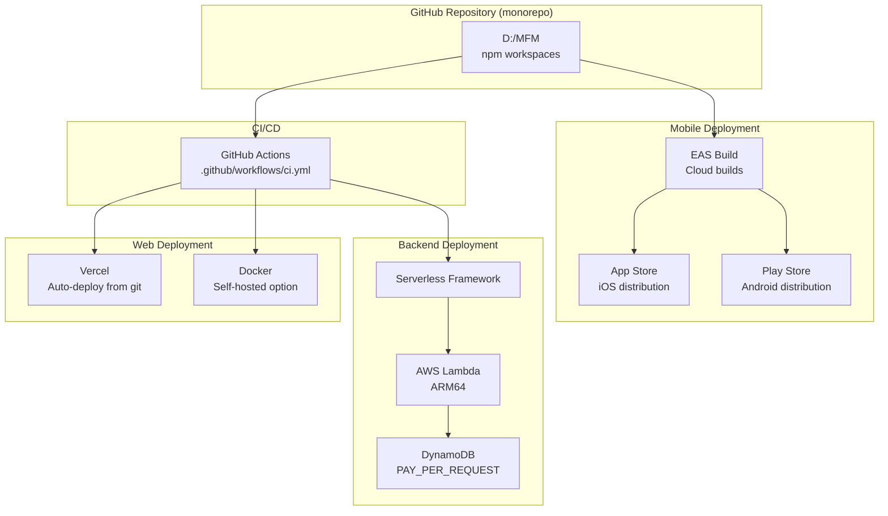
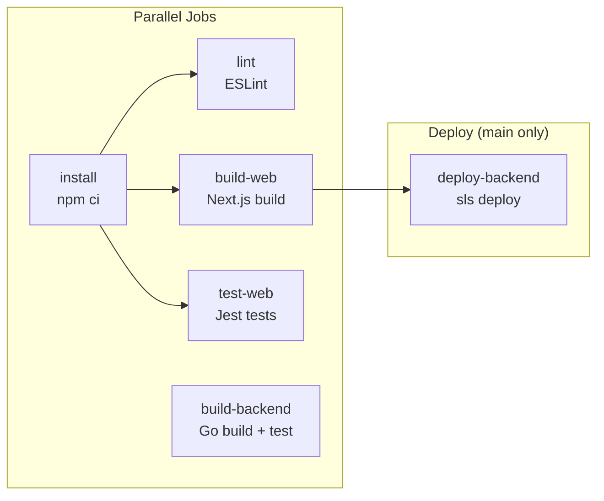

# Walkthrough: MFM Monorepo Architecture & Deployment

## Monorepo Structure

```
D:\MFM/                                ← npm workspaces root
├── package.json                       ← workspaces: ["packages/*", "frontend", "mobile-app"]
├── .gitignore
├── .github/workflows/ci.yml           ← CI/CD pipeline
├── vercel.json                        ← Vercel deployment config
├── Dockerfile.web                     ← Docker production build
│
├── packages/
│   └── shared/                        ← @mfm/shared (single source of truth)
│       ├── package.json  
│       ├── tsconfig.json
│       └── src/
│           ├── index.ts               ← Barrel export
│           ├── types/product.ts       ← Unified Product interface
│           ├── store/storage.ts       ← StorageAdapter interface
│           ├── store/use*.ts          ← 8 Zustand stores
│           ├── services/api.ts        ← API layer
│           ├── hooks/useProducts.ts   ← React Query hooks
│           └── constants/             ← Mock data, admin accounts
│
├── frontend/                          ← Next.js 16 web app
│   ├── src/lib/storage.ts             ← localStorage adapter
│   ├── src/store/*.ts                 ← Re-exports from @mfm/shared
│   └── next.config.ts                 ← transpilePackages + standalone
│
├── mobile-app/                        ← Expo 54 / React Native 0.81
│   ├── eas.json                       ← EAS Build profiles
│   ├── src/lib/storage.ts             ← AsyncStorage adapter
│   └── src/store/*.ts                 ← Re-exports from @mfm/shared
│
└── backend/                           ← Go serverless API
    ├── serverless.yml                 ← AWS Lambda + DynamoDB
    └── docker-compose.yml             ← Local DynamoDB
```

---

## Deployment Architecture



---

## Deployment Option 1: Vercel (Web Frontend)

**Recommended for simplicity.** Vercel natively understands npm workspaces.

### Setup
1. Push the monorepo to GitHub
2. Import the repo in [vercel.com/new](https://vercel.com/new)
3. Vercel reads [vercel.json](file:///D:/MFM/vercel.json) automatically:
   - Installs from root (`npm install` → workspaces linked)
   - Builds using `npm run build --workspace=frontend`
   - `transpilePackages: ['@mfm/shared']` compiles the shared package inline

### What's configured
| Setting | Value |
|---|---|
| Root Directory | `.` (monorepo root) |
| Build Command | `npm run build --workspace=frontend` |
| Output Directory | `frontend/.next` |
| Install Command | `npm install` |
| Framework | Next.js (auto-detected) |

### Environment Variables (set in Vercel dashboard)
```
NEXT_PUBLIC_API_URL=https://YOUR_API_GATEWAY_URL/api
```

> [!TIP]
> Vercel auto-deploys on every push to `main`. PR branches get preview deployments automatically.

---

## Deployment Option 2: Docker (Self-hosted)

For AWS ECS, Google Cloud Run, or any container platform.

### Build & run
```bash
# Build from monorepo root
docker build -f Dockerfile.web -t mfm-web .

# Run
docker run -p 3000:3000 mfm-web
```

### How [Dockerfile.web](file:///D:/MFM/Dockerfile.web) works
1. **deps stage**: Copies only `package.json` files, runs `npm ci` (workspace-aware)
2. **builder stage**: Copies `packages/shared/` + `frontend/`, runs `npm run build`
3. **runner stage**: Uses Next.js `standalone` output for a **minimal image** (~100MB vs ~1GB)

> [!IMPORTANT]
> The `output: 'standalone'` setting in [next.config.ts](file:///D:/MFM/frontend/next.config.ts) is required for Docker. It bundles all dependencies into a self-contained `server.js`.

---

## Deployment: Mobile App (EAS Build)

Expo's EAS Build handles monorepo workspaces natively. The [eas.json](file:///D:/MFM/mobile-app/eas.json) defines three profiles:

| Profile | Use Case | Distribution |
|---|---|---|
| `development` | Local dev builds with dev client | Internal (USB/link) |
| `preview` | QA/testing — builds as APK | Internal (shareable link) |
| `production` | Store submission — auto-increments version | App Store / Play Store |

### Build commands
```bash
cd mobile-app

# Development build (for testing with Expo dev client)
eas build --profile development --platform android

# Preview build (share APK with team)
eas build --profile preview --platform android

# Production build (for store submission)
eas build --profile production --platform all

# Submit to stores
eas submit --profile production --platform all
```

### Monorepo compatibility
Metro bundler automatically follows the `@mfm/shared` workspace symlink. No extra configuration needed — Expo's workspaces support is built-in.

> [!NOTE]
> Before first EAS build, run `eas build:configure` to link to your Expo account. You'll also need to update `eas.json` with your Apple Team ID and Google service account for store submissions.

---

## Deployment: Backend (AWS Lambda)

Already configured via [serverless.yml](file:///D:/MFM/backend/serverless.yml):

```bash
cd backend
make deploy    # Builds Go binary + deploys to Lambda
```

| Resource | Config |
|---|---|
| Runtime | Go (provided.al2, ARM64) |
| Database | DynamoDB (PAY_PER_REQUEST) |
| API | HTTP API Gateway (httpApi) |
| Region | us-east-1 |

---

## CI/CD Pipeline

The [GitHub Actions workflow](file:///D:/MFM/.github/workflows/ci.yml) runs on every push to `main`/`develop`:



| Job | Trigger | What it does |
|---|---|---|
| `install` | All PRs & pushes | `npm ci`, caches `node_modules` for all workspaces |
| `lint` | All | ESLint on frontend |
| `build-web` | All | `npm run build --workspace=frontend` (validates @mfm/shared integration) |
| `test-web` | All | Jest unit tests |
| `build-backend` | All | `go build` + `go test` |
| `deploy-backend` | main push only | `sls deploy --stage production` |

> [!IMPORTANT]
> Web deployment to Vercel happens outside GitHub Actions — Vercel's GitHub app auto-deploys on push. The CI just validates the build passes.

---

## Monorepo Commands Reference

Run all commands from `D:\MFM` (root):

```bash
# Development
npm run dev:web          # Start Next.js dev server
npm run dev:mobile       # Start Expo dev server

# Building  
npm run build:web        # Production build of web frontend

# Testing
npm run test             # Run tests in all workspaces
npm run lint             # Lint all workspaces

# Deployment
cd backend && make deploy                    # Deploy Lambda
cd mobile-app && eas build --profile preview # Build mobile APK
# Web: auto-deployed by Vercel on git push
```

---

## Files Created in This Session

| File | Purpose |
|---|---|
| [package.json](file:///D:/MFM/package.json) | Root monorepo with npm workspaces |
| [vercel.json](file:///D:/MFM/vercel.json) | Vercel deployment configuration |
| [Dockerfile.web](file:///D:/MFM/Dockerfile.web) | Multi-stage Docker build for web |
| [.github/workflows/ci.yml](file:///D:/MFM/.github/workflows/ci.yml) | Full CI/CD pipeline |
| [mobile-app/eas.json](file:///D:/MFM/mobile-app/eas.json) | EAS Build profiles (dev/preview/prod) |
| [packages/shared/](file:///D:/MFM/packages/shared) | 17 shared source files |
| [frontend/src/lib/storage.ts](file:///D:/MFM/frontend/src/lib/storage.ts) | Web storage adapter |
| [mobile-app/src/lib/storage.ts](file:///D:/MFM/mobile-app/src/lib/storage.ts) | Mobile storage adapter |
| 22 re-export wrappers | Backwards compatibility for existing imports |

## Validation
- ✅ `npm install` — all workspaces linked successfully
- ✅ `npm run build` (frontend) — all 14 routes compiled, zero type errors
- ✅ Re-exports — all existing component imports resolve correctly
